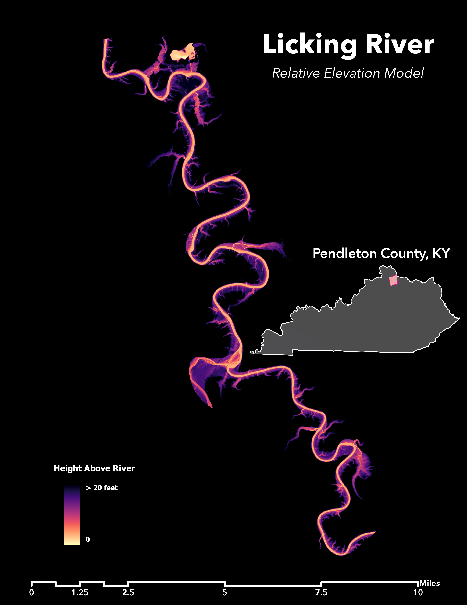

## Mapping Our Kentucky Landscapes!

# 3D visualization of Berea, Kentucky

<iframe src="https://player.vimeo.com/video/695074889?h=8939e4e89f&amp;badge=0&amp;autopause=0&amp;player_id=0&amp;app_id=58479" frameborder="0" allow="autoplay; fullscreen; picture-in-picture" allowfullscreen style="position:absolute;top:0;left:0;width:100%;height:100%;" title="Berea Animation.mp4"></iframe>

*This particular peak has a stunning view of the East and West Pinnacles. Located in Madison County, Berea is a popular hiking destination for Kentuckians*

# Digital Elevation Model of the Licking River

*This DEM showcases the depth of the Licking River. This particular piece of the river is located in Pendleton County and spans about 25 miles, but the total length of the Licking River is 303 miles!*